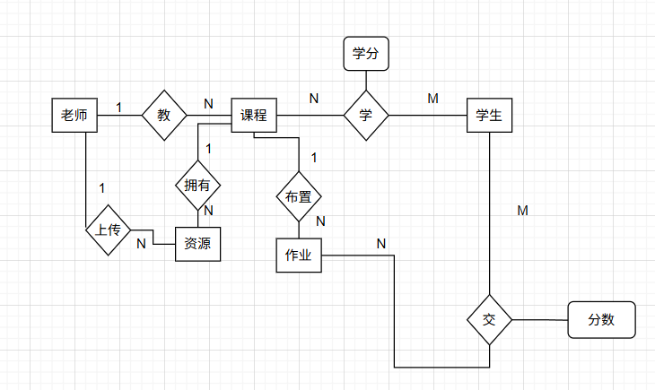

# 目前未完成和待优化的任务
课程，作业删除对应的学分表和成绩表也应该删除也没有测试
# 一、数据库设计

属性没有画出来

## student 学生表
### 属性
student_id 学号
password 密码
name 名字
clazz 专业及班级
sex 性别 0女1男
### 建表语句
CREATE TABLE `student` (
`student_id` int NOT NULL COMMENT '学号',
`password` varchar(50) DEFAULT NULL COMMENT '密码',
`name` varchar(50) DEFAULT NULL COMMENT '姓名',
`clazz` varchar(100) DEFAULT NULL COMMENT '专业及班级',
`sex` tinyint DEFAULT NULL COMMENT '性别',
PRIMARY KEY (`student_id`)
) ENGINE=InnoDB DEFAULT CHARSET=utf8mb4 COLLATE=utf8mb4_0900_ai_ci COMMENT='学生'

## teacher 教师表
### 属性
teacher_id 工号
password 密码
name 名字
sex 性别 0女1男
### 建表语句
CREATE TABLE `teacher` (
`teacher_id` int NOT NULL COMMENT '工号',
`password` varchar(50) DEFAULT NULL COMMENT '密码',
`name` varchar(50) DEFAULT NULL COMMENT '老师名字',
`sex` tinyint DEFAULT NULL COMMENT '性别',
PRIMARY KEY (`teacher_id`)
) ENGINE=InnoDB DEFAULT CHARSET=utf8mb4 COLLATE=utf8mb4_0900_ai_ci COMMENT='教师'

## course 课程表
### 属性
id 课程号
name 课程名
teacher_id  授课老师工号
status 课程状态
description 课程描述
create_time 课程创建时间
update_time 课程更改时间
### 建表语句
CREATE TABLE `course` (
`id` int NOT NULL AUTO_INCREMENT COMMENT '课程号',
`name` varchar(100) DEFAULT NULL COMMENT '课程名称',
`teacher_id` int DEFAULT NULL COMMENT 'teacher_id',
`course_statue` int DEFAULT '0' COMMENT '0为进行中，1为批阅中，2为完成,默认0',
`description` varchar(500) DEFAULT NULL COMMENT '课程描述',
`create_time` datetime DEFAULT NULL COMMENT '创建时间',
`update_time` datetime DEFAULT NULL COMMENT '更新时间',
`term_period` varchar(100) DEFAULT NULL COMMENT '学期',
PRIMARY KEY (`id`)
) ENGINE=InnoDB AUTO_INCREMENT=1031 DEFAULT CHARSET=utf8mb4 COLLATE=utf8mb4_0900_ai_ci COMMENT='课程'

## work 作业表
### 属性
id 作业唯一标识
name 作业内容而且后面附带日期
course_id 交的作业所属课程id

### 建表语句
CREATE TABLE `work` (
`id` int NOT NULL AUTO_INCREMENT COMMENT '作业唯一标识',
`name` varchar(100) DEFAULT NULL COMMENT '作业名称',
`course_id` int DEFAULT NULL COMMENT '交的作业所属课程id',
PRIMARY KEY (`id`)
) ENGINE=InnoDB AUTO_INCREMENT=22 DEFAULT CHARSET=utf8mb4 COLLATE=utf8mb4_0900_ai_ci COMMENT='作业'

## credit 学分表
### 属性
course_id 课程号
student_id 学号
credit 学分
### 建表语句
CREATE TABLE `credit` (
`course_id` int NOT NULL COMMENT '课程号',
`student_id` int NOT NULL COMMENT '学号',
`credit` varchar(50) DEFAULT NULL COMMENT '学分',
PRIMARY KEY (`course_id`,`student_id`)
) ENGINE=InnoDB DEFAULT CHARSET=utf8mb4 COLLATE=utf8mb4_0900_ai_ci COMMENT='学分'

## resource 资源表
### 属性
id id号
name 名称
course_id 课程号
teacher_id 工号
update_time 更新时间
create_time 创建时间
position 资源保存路径
type 资料类型（课件，教材，习题，文件，试卷）
picture 图片路径
size 文件大小
document_type 文件后缀名
### 建表语句
CREATE TABLE `resource` (
`id` int NOT NULL AUTO_INCREMENT COMMENT 'id',
`name` varchar(100) DEFAULT NULL COMMENT '名称',
`course_id` int DEFAULT NULL COMMENT '课程号',
`teacher_id` int DEFAULT NULL COMMENT '工号',
`update_time` datetime DEFAULT NULL COMMENT '更新时间',
`create_time` datetime DEFAULT NULL COMMENT '创建时间',
`position` varchar(512) CHARACTER SET utf8mb4 COLLATE utf8mb4_0900_ai_ci NOT NULL COMMENT '资源保存路径',
`type` int DEFAULT NULL COMMENT '资料类型，课件，教材，习题，文件，试卷',
`picture` varchar(512) CHARACTER SET utf8mb4 COLLATE utf8mb4_0900_ai_ci DEFAULT NULL COMMENT '图片路径',
`size` bigint DEFAULT NULL COMMENT '文件大小',
`document_type` varchar(30) DEFAULT NULL COMMENT '文件后缀名',
PRIMARY KEY (`id`)
) ENGINE=InnoDB AUTO_INCREMENT=1019 DEFAULT CHARSET=utf8mb4 COLLATE=utf8mb4_0900_ai_ci

## score 成绩表
### 属性
work_id 作业id
student_id 学号
score 分数
status 作业是否被批阅
position 作业所保存的路径
### 建表语句
CREATE TABLE `score` (
`work_id` int NOT NULL COMMENT '作业id',
`student_id` int NOT NULL COMMENT '学号',
`score` decimal(3,1) DEFAULT NULL COMMENT '分数',
`work_status` int DEFAULT NULL COMMENT '作业状态0未批阅1已批阅',
`position` varchar(255) CHARACTER SET utf8mb4 COLLATE utf8mb4_0900_ai_ci DEFAULT NULL COMMENT '作业保存位置',
PRIMARY KEY (`work_id`,`student_id`)
) ENGINE=InnoDB DEFAULT CHARSET=utf8mb4 COLLATE=utf8mb4_0900_ai_ci

# 二、教师端功能
返回结果最终都由result类进行封装
## 1 登录
/teacher/login
LoginDTO Integer id,String password
LoginVO Integer id，String name，Integer sex，String clazz，String token
## 2 注册
/teacher/register
Teacher Integer id,String password,String name,Integer sex
Result
## 3 分页查询课程
/teacher/course/find
FindCourseDTO Long current,Long pageSize,Integer id,String name,Integer courseStatus,boolean isAll
CourseVO Integer id，String name，Integer courseStatus，String description;
## 4 添加课程
/teacher/course/save
SaveCourseDTO String name,String description,termPeriod;
Result
## 5 更改课程
/teacher/course/update
UpdateCourseDTO
* Integer id，String name,String description,termPeriod;
* Result
## 6 删除课程
/teacher/course/delete
Integer id
Result
# 此后的接口不在设计md中写参考代码注释